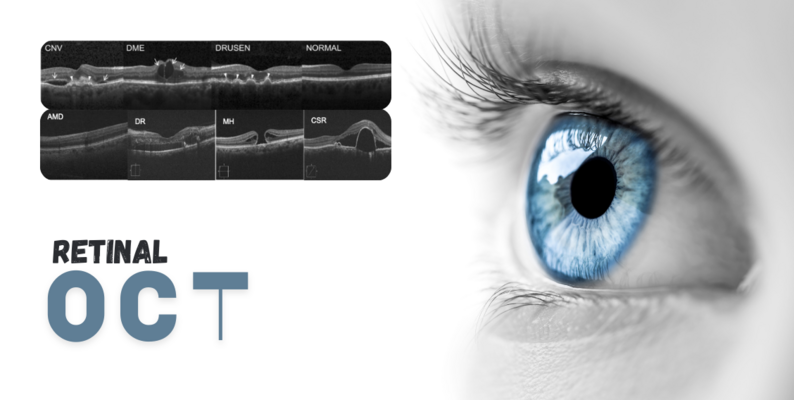

# DigitalHealth_retinal-OCT-C8
Deep learning–based retinal OCT image classification using VGG19, ResNet50, and DenseNet architectures, integrated with Orange3 for visual ML workflow and interpretability.


# 🩺 Retinal OCT C8 Classification using Deep Learning and Orange3



## 📘 Overview
This project focuses on **multi-class retinal disease classification** using **Optical Coherence Tomography (OCT)** scans. Leveraging state-of-the-art **Convolutional Neural Networks (CNNs)**—VGG19, ResNet50, DenseNet121, and DenseNet169—along with a **low-code Orange3 environment**, the project achieves accurate, interpretable, and efficient retinal diagnosis.

The models were evaluated on the **Retinal OCT C8 dataset** from Kaggle, containing **eight disease classes**, representing one of the most comprehensive OCT datasets available.

> 🧠 Dataset Link: [Retinal OCT C8 (Kaggle)](https://www.kaggle.com/datasets/obulisainaren/retinal-oct-c8)

---

## 🧩 Dataset Description

The **Retinal OCT C8 dataset** contains **24,000 OCT scans** categorized into 8 retinal conditions:

| Class | Description |
|-------|--------------|
| AMD | Age-related Macular Degeneration |
| CNV | Choroidal Neovascularization |
| CSR | Central Serous Retinopathy |
| DME | Diabetic Macular Edema |
| DR | Diabetic Retinopathy |
| Drusen | Lipid/protein deposits on retina |
| MH | Macular Hole |
| Normal | Healthy retina |

**Dataset Split:**
- **Training:** 18,400 images  
- **Validation:** 2,800 images  
- **Testing:** 2,800 images  

Preprocessing steps included **resizing (128×128)**, **normalization ([0,1])**, and **data augmentation** (rotation, flipping, brightness).

---

## ⚙️ Methodology

### 🔹 Deep Learning Models

#### 1. VGG19
- Optimizer: **Adam (LR = 1e-4)**  
- Early stopping at **epoch 14**
- Achieved **95.18% validation accuracy**
- Demonstrated smooth convergence and high generalization


---

#### 2. ResNet50
- Optimizer: **Adam (LR = 0.001 → 6.25e-5)**
- Trained for **45 epochs**
- Validation accuracy peaked at **86%**
- Exhibited stable learning and strong feature discrimination


---

#### 3. DenseNet121
- Dense connectivity enhances gradient flow  
- Validation accuracy improved from **70% → 83%**  
- Stable and robust generalization  


---

#### 4. DenseNet169
- Achieved **98.04% test accuracy**
- Outperformed all previous backbones
- Showed superior stability and convergence  


---

## 🟧 Orange3 Workflow Integration

In addition to model training, the project utilized the **Orange3** low-code ML platform to:
- Visualize deep learning workflows  
- Extract and classify CNN embeddings  
- Compare classical classifiers (SVM, Logistic Regression, Random Forest, Neural Network, Naive Bayes)  

### Example: Orange Flow for VGG19 Embeddings


**Key Results:**

| Model | Accuracy (CA) | AUC | F1 | MCC |
|--------|----------------|-----|----|-----|
| Logistic Regression | 0.889 | 0.988 | 0.889 | 0.873 |
| Neural Network | 0.898 | 0.989 | 0.898 | 0.883 |
| SVM | 0.804 | 0.974 | 0.803 | 0.776 |
| Random Forest | 0.570 | 0.964 | 0.560 | 0.723 |
| Naive Bayes | 0.500 | 0.954 | 0.749 | 0.714 |

> 🧩 Observation: Logistic Regression and Neural Networks provided the best trade-off between accuracy and interpretability, while Random Forest and Naive Bayes underperformed due to high-dimensional embeddings.

---

## 📈 Results Summary

| Model | Validation Accuracy | Test Accuracy | Best Classifiers (Orange) |
|--------|----------------------|---------------|----------------------------|
| **VGG19** | 95.18% | 94.8% | Logistic Regression, NN |
| **ResNet50** | 86% | 85.4% | Logistic Regression, NN |
| **DenseNet121** | 83% | 86.9% | Logistic Regression, NN |
| **DenseNet169** | 97.82% | 98.04% | Neural Network, SVM |

---

## 💡 Key Insights
- **DenseNet169** outperformed all architectures in accuracy and stability.  
- **Orange3 workflows** provided a transparent, low-code way to interpret CNN features.  
- The study demonstrated how **transfer learning + low-code AI** can simplify ophthalmic diagnostic systems.  
- **Misclassifications** occurred mainly between **DME–CNV** and **Drusen–CNV** due to similar visual morphology.  

---

## 🧰 Tech Stack

| Category | Tools / Frameworks |
|-----------|-------------------|
| Deep Learning | TensorFlow, Keras |
| Data Handling | NumPy, Pandas |
| Visualization | Matplotlib, Seaborn |
| Low-Code ML | Orange3 |
| Dataset Source | Kaggle |
| Environment | Jupyter Notebook / Colab |

---

## 🧪 Future Work
- Introduce **Attention-based CNNs** and **Vision Transformers**
- Develop **multi-modal fusion** with fundus images and patient data  
- Integrate **Explainable AI (Grad-CAM, LIME)** for clinical trust  
- Deploy model via **Streamlit dashboard for real-time OCT classification**

---

## 📂 Project Structure
```
Retinal-OCT-C8/
│
├── notebooks/
│   ├── VGG19_Model.ipynb
│   ├── ResNet50_Model.ipynb
│   ├── DenseNet121_Model.ipynb
│   ├── DenseNet169_Model.ipynb
│
├── assets/
│   ├── oct_banner.jpg
│   ├── orange_flow.png
│
├── results/
│   ├── confusion_matrices/
│   ├── training_logs/
│
└── README.md
```

---

## 👥 Contributors
- **Shashvat Rajora** – Deep Learning Model Design, Orange3 Workflow  
- **Shivam Kumar Jha** – Data Processing & Experimental Analysis  
- **Abhyuday Singh Panwar** – Model Optimization & Evaluation  
- **Pushkal Tiwari** – Visualization & Report Drafting  
- **Surabhi Krishna** – Dataset Handling & Validation Analysis  

---
